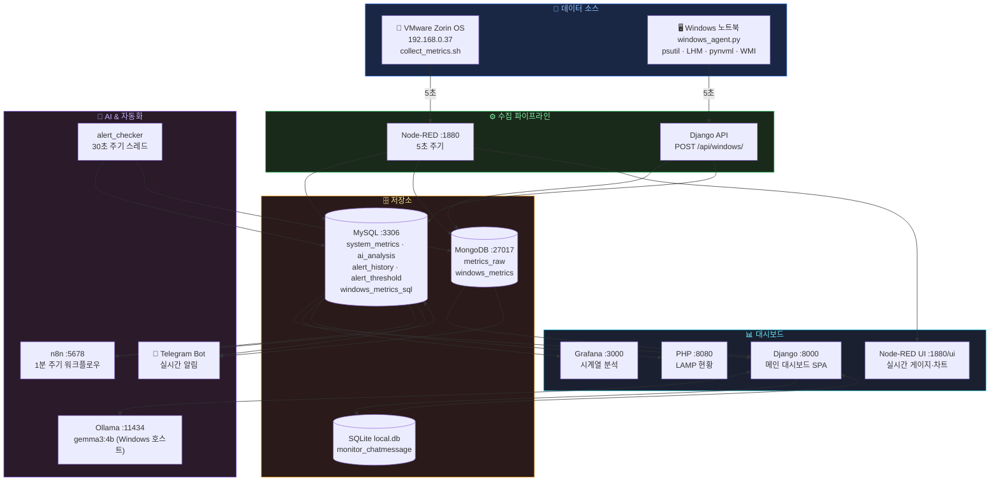

# AI Infra Monitor

VMware 가상머신(Zorin OS) + Windows 노트북을 통합 모니터링하는 AI 기반 인프라 대시보드.  
Node-RED로 메트릭을 수집하고 Django·Grafana·Node-RED UI·PHP 4개 채널로 시각화하며,  
Ollama LLM 분석과 Telegram 실시간 알림까지 하나의 Docker Compose로 묶은 풀스택 프로젝트.

---

## 목차

1. [기술 스택](#기술-스택)
2. [아키텍처](#아키텍처)
3. [서비스 목록](#서비스-목록)
4. [주요 기능](#주요-기능)
5. [디렉토리 구조](#디렉토리-구조)
6. [데이터베이스 구조](#데이터베이스-구조)
7. [API 엔드포인트](#api-엔드포인트)
8. [환경 설정](#환경-설정)
9. [실행 방법](#실행-방법)
10. [Windows 에이전트](#windows-에이전트)
11. [Node-RED 대시보드 설정](#node-red-대시보드-설정)
12. [Telegram 봇](#telegram-봇)
13. [알림 시스템](#알림-시스템)

---

## 기술 스택

| 분류 | 기술 |
|------|------|
| **컨테이너** | Docker Compose |
| **백엔드** | Django 5.0, Python 3.12 |
| **데이터 수집** | Node-RED 3.x, Shell 스크립트 |
| **DB** | MySQL 8.0, MongoDB 7.0, SQLite 3 |
| **시각화** | Django Dashboard (Chart.js), Node-RED Dashboard (게이지/차트), Grafana, PHP |
| **AI** | Ollama (gemma3:4b, 로컬 LLM) |
| **자동화** | n8n, alert_checker (Django 백그라운드 스레드) |
| **알림** | Telegram Bot API |
| **Windows 수집** | psutil, LibreHardwareMonitor DLL, pynvml, pywin32, WMI |

---

## 아키텍처



---

## 서비스 목록

| 서비스 | 컨테이너 | 포트 | 역할 | 기본 계정 |
|--------|----------|:----:|------|----------|
| Django | aim-django | **8000** | 메인 대시보드 & REST API | — |
| MySQL | aim-mysql | **3306** | 구조화 메트릭 저장 | `.env` 참조 |
| MongoDB | aim-mongodb | **27017** | 원시 로그 (JSON) 저장 | `.env` 참조 |
| Grafana | aim-grafana | **3000** | 시계열 시각화 | admin / admin123 |
| Node-RED | aim-node-red | **1880** | 메트릭 수집 · 실시간 게이지 | — |
| n8n | aim-n8n | **5678** | 자동화 워크플로우 | admin / admin123 |
| PHP | aim-php | **8080** | LAMP 스택 현황 페이지 | — |
| Ollama | (외부) | **11434** | 로컬 LLM (Windows 호스트) | — |

---

## 주요 기능

### Django 대시보드 (SPA)

사이드바 네비게이션 + 서브 탭 구조의 단일 페이지 대시보드.  
모든 데이터는 REST API로 실시간 폴링 (5초 갱신).

#### 🐧 VMware Zorin OS 탭

카테고리별 서브 탭:

| 서브 탭 | 내용 |
|---------|------|
| 📊 개요 | CPU·메모리·디스크 수치 카드, 실시간 라인 차트, MySQL·MongoDB·SQLite 레코드 현황 |
| ⚙️ CPU | 현재값 카드 + 트렌드 차트 + CPU 메트릭 로그 (MySQL) |
| 🧠 메모리 | 현재값 카드 + 트렌드 차트 + 메모리 메트릭 로그 |
| 💿 디스크 | 현재값 카드 + 트렌드 차트 + 디스크 메트릭 로그 |
| 🌐 네트워크 | 네트워크 I/O 로그 (MongoDB metrics_raw, 송신/수신 KB) |

#### 🖥️ Windows 노트북 탭

하드웨어 카테고리별 서브 탭:

| 서브 탭 | 내용 |
|---------|------|
| 📊 개요 | 실시간 미니 차트 8개 (CPU·GPU 사용률·온도·전력·클럭, RAM %) |
| ⚙️ CPU | 사용률·패키지 온도·유효 클럭·패키지 전력·코어 상세 |
| 🎮 GPU | 사용률·VRAM·온도·코어 클럭·메모리 클럭·전력·팬속도 |
| 🧠 RAM | 사용량 GB·물리 총용량·클럭(MHz)·스왑 |
| 💿 디스크 | 드라이브별 전체/사용/여유/사용률 테이블 |
| 🌐 네트워크 | NIC별 송수신 누적 바이트·오류 테이블 |
| 📜 로그 | MongoDB `windows_metrics` 원시 로그 (필터: 전체 / CPU / GPU / RAM) |

#### 🤖 AI 채팅 탭

- **AI 분석**: VMware 또는 Windows 최신 메트릭 → Ollama 전송 → 서버 상태 평가 리포트
- **AI 채팅**: Ollama와 자유 대화 (SQLite 히스토리 영속 저장, 빠른 질문 버튼 제공)
- 분석 대상 전환: VMware ↔ Windows

#### 🗃️ All DB Dashboard 탭

| 서브 탭 | 내용 |
|---------|------|
| 📊 전체 현황 | MySQL·MongoDB·SQLite 테이블별 레코드 수 카드 |
| 🐬 MySQL | 테이블 구조 설명 + 최근 데이터 조회 |
| 🍃 MongoDB | VMware 로그 (`metrics_raw`) + Windows 로그 (`windows_metrics`) |
| 💾 SQLite | AI 채팅 히스토리 전체 조회 |

#### 🚨 알림 이력 탭

- 임계값 설정 UI (VMware 3개 항목 + Windows 6개 항목, 쿨다운 설정)
- 알림 현황 카드 9개 (항목별 발생 횟수 + 현재값 실시간 표시)
- Telegram 봇 발송 이력
- 전체 알림 로그 테이블

#### 🔗 서비스 탭

- 전체 서비스 연결 카드 (클릭 시 해당 서비스 이동)
- Mermaid.js 데이터 흐름 아키텍처 다이어그램 (런타임 렌더링)

---

### Node-RED 대시보드 (`/ui`)

| 탭 | 그룹 구성 |
|----|----------|
| 🐧 Linux VM | CPU / 메모리 / 디스크 / 네트워크 — 각 그룹 게이지(width 4) + 시계열 차트(width 8) |
| 🖥️ Windows 노트북 | CPU / CPU온도 / GPU / GPU온도 / VRAM / RAM&스왑 / 네트워크 — 게이지 + 차트 |

- 5초 갱신, 시작 시 차트 캐시 자동 초기화 (inject reset 노드)
- 네트워크는 MB/s 실시간 속도 (누적 바이트 차분 계산, context 저장)
- Node-RED v2 API로 플로우 프로그래밍 방식 배포 (`POST /flows`)

---

### Grafana

- MySQL `system_metrics` 데이터소스 자동 프로비저닝
- CPU·메모리·디스크 시계열 패널 자동 생성

### PHP Monitor

- MySQL 메트릭을 읽어 테이블로 표시 (5초 자동 새로고침, `<meta http-equiv="refresh">`)

---

## 디렉토리 구조

```
ai-infra-monitor/
├── docker-compose.yml            # 전체 서비스 정의
├── .env                          # 환경변수 (Git 제외)
├── .gitignore
├── simulate_load.sh              # CPU·메모리 부하 시뮬레이션 스크립트
│
├── django/
│   ├── Dockerfile
│   ├── requirements.txt
│   ├── entrypoint.sh
│   ├── manage.py
│   ├── config/
│   │   ├── settings.py           # DB 라우터, Installed Apps
│   │   ├── routers.py            # SQLite ↔ MySQL DB 라우팅
│   │   └── urls.py
│   └── monitor/
│       ├── models.py             # SystemMetric, AIAnalysis, AlertHistory, AlertThreshold 등
│       ├── views.py              # REST API + 대시보드 뷰
│       ├── urls.py
│       ├── apps.py               # ready() → 봇·알림체커 스레드 자동 시작
│       ├── telegram_bot.py       # Telegram 폴링 봇 (/vmware /windows /status /thresh)
│       ├── alert_checker.py      # 30초 주기 임계값 체크 스레드
│       └── templates/monitor/
│           └── dashboard.html    # 단일 페이지 SPA (Chart.js, Mermaid.js)
│
├── mysql/
│   └── init.sql                  # 테이블 초기 생성
│
├── node-red/
│   ├── Dockerfile
│   ├── flows.json                # 메트릭 수집 플로우
│   ├── collect_metrics.sh        # Shell 수집 스크립트 (CPU·메모리·디스크·네트워크)
│   └── data/
│       ├── settings.js
│       └── package.json          # node-red-dashboard 패키지
│
├── grafana/
│   └── provisioning/
│       ├── dashboards/
│       │   ├── provider.yml
│       │   └── infra-monitor.json
│       └── datasources/
│           └── mysql.yml         # MySQL 데이터소스 자동 연결
│
├── n8n/
│   └── workflow.json             # 임계값 모니터링 워크플로우 (Import용)
│
├── php/
│   ├── Dockerfile
│   └── index.php                 # PHP 모니터링 페이지
│
└── windows_agent/
    ├── windows_agent.py          # 수집 에이전트 (5초 주기, 관리자 권한 필요)
    ├── run_agent.bat             # 실행 배치 (우클릭 → 관리자 권한)
    ├── requirements.txt
    └── lib/
        └── LibreHardwareMonitorLib.dll  # 별도 다운로드 필요
```

---

## 데이터베이스 구조

### MySQL (`infra_monitor`)

| 테이블 | 설명 | 수집 주체 | 주기 |
|--------|------|----------|------|
| `system_metrics` | VMware Zorin OS 시스템 메트릭 | Node-RED | 5초 |
| `ai_analysis` | Ollama AI 분석 결과 | Django | 수동 요청 |
| `alert_history` | 임계값 초과 알림 이력 | alert_checker | 임계값 초과 시 |
| `alert_threshold` | 알림 임계값 설정 (단일 행) | 사용자 | 대시보드 |
| `alert_cooldown` | 알림 쿨다운 추적 | alert_checker | 자동 |
| `telegram_bot_log` | Telegram 발송 로그 | alert_checker | 알림 시 |
| `windows_metrics_sql` | Windows 메트릭 MySQL 미러 | Django | 5초 |

**`alert_threshold` 기본값**

| 항목 | 기본값 |
|------|--------|
| VMware CPU | 80% |
| VMware RAM | 85% |
| VMware 디스크 | 90% |
| Windows CPU % | 80% |
| Windows CPU 온도 | 85°C |
| Windows GPU % | 85% |
| Windows GPU 온도 | 85°C |
| Windows VRAM | 90% |
| Windows RAM | 85% |
| 알림 쿨다운 | 5분 |

### MongoDB (`infra_logs`)

| 컬렉션 | 설명 | 수집 주기 |
|--------|------|----------|
| `metrics_raw` | VMware 원시 메트릭 JSON | 5초 (Node-RED → Django) |
| `windows_metrics` | Windows 하드웨어 전체 데이터 | 5초 (에이전트 → Django) |

**`windows_metrics` 문서 구조**

```json
{
  "hostname": "DESKTOP-XXXX",
  "os": "Windows 11",
  "lhm_active": true,
  "cpu": {
    "model": "Intel Core i7-...",
    "usage_pct": 12.5,
    "temp_package_c": 62.0,
    "power_package_w": 35.2,
    "freq_effective_mhz": 3200,
    "physical": 8, "logical": 16
  },
  "gpu": {
    "name": "NVIDIA GeForce RTX ...",
    "usage_pct": 5.0,
    "temp_c": 55.0,
    "mem_pct": 30.2,
    "mem_used_mb": 2458, "mem_total_mb": 8192,
    "clock_core_mhz": 1800, "clock_mem_mhz": 7000,
    "power_w": 80.0, "power_limit_w": 150.0,
    "fan_pct": 40
  },
  "memory": {
    "percent": 55.3,
    "used_gb": 17.7, "total_gb": 32.0,
    "clock_mhz": 3200,
    "swap_used_gb": 0.0, "swap_total_gb": 10.0
  },
  "disks": [
    {"device": "C:\\", "total_gb": 500, "used_gb": 200, "percent": 40.0}
  ],
  "network": {
    "이더넷": {"bytes_sent": 12345678, "bytes_recv": 98765432}
  },
  "timestamp": "2026-04-24T12:00:00Z"
}
```

### SQLite (`/app/data/local.db`)

| 테이블 | 설명 |
|--------|------|
| `monitor_chatmessage` | AI 채팅 히스토리 (role: user/assistant, content, created_at) |

---

## API 엔드포인트

베이스 URL: `http://<VMware_IP>:8000`

### VMware / 공통

| 메서드 | 경로 | 설명 |
|--------|------|------|
| GET | `/` | 메인 대시보드 HTML |
| GET | `/api/metrics/` | 최근 VMware 메트릭 (MySQL, 최대 100건) |
| GET | `/api/logs/` | VMware 원시 로그 (MongoDB, `?limit=N`) |
| POST | `/api/log/` | Node-RED → MongoDB 로그 저장 |
| POST | `/api/analyze/` | VMware 메트릭 Ollama AI 분석 |

### Windows

| 메서드 | 경로 | 설명 |
|--------|------|------|
| POST | `/api/windows/` | 에이전트 데이터 수신 (MongoDB + MySQL 저장) |
| GET | `/api/windows/latest/` | 최신 Windows 메트릭 1건 |
| GET | `/api/windows/history/` | 최근 N건 히스토리 (`?limit=60`) |
| GET | `/api/windows/logs/` | MongoDB Windows 로그 (`?limit=N`) |
| POST | `/api/analyze/windows/` | Windows 메트릭 Ollama AI 분석 |

### AI 채팅

| 메서드 | 경로 | 설명 |
|--------|------|------|
| POST | `/api/chat/` | Ollama 채팅 (`{"message":"...", "system":"vmware"}`) |
| GET | `/api/chat/history/` | SQLite 채팅 히스토리 |
| DELETE | `/api/chat/clear/` | 채팅 히스토리 초기화 |

### 알림 & 임계값

| 메서드 | 경로 | 설명 |
|--------|------|------|
| GET/POST | `/api/thresholds/` | 임계값 조회 / 저장 |
| GET | `/api/alerts/` | 알림 이력 목록 |
| GET | `/api/alerts/stats/` | 알림 타입별 집계 |
| GET | `/api/bot/logs/` | Telegram 발송 로그 |

### DB 현황

| 메서드 | 경로 | 설명 |
|--------|------|------|
| GET | `/api/db/overview/` | MySQL + MongoDB + SQLite 통합 현황 |

---

## 환경 설정

프로젝트 루트에 `.env` 파일 생성:

```env
# MySQL
MYSQL_ROOT_PASSWORD=rootpassword123
MYSQL_DATABASE=infra_monitor
MYSQL_USER=monitor_user
MYSQL_PASSWORD=monitor_pass123

# MongoDB
MONGO_USER=mongo_admin
MONGO_PASSWORD=mongo_pass123

# Grafana
GRAFANA_USER=admin
GRAFANA_PASSWORD=admin123

# n8n
N8N_USER=admin
N8N_PASSWORD=admin123

# Django
DJANGO_SECRET_KEY=django-secret-key-change-this-in-production-abc123xyz

# Ollama (Windows 호스트 IP)
OLLAMA_HOST=http://192.168.0.11:11434
OLLAMA_MODEL=gemma3:4b

# Telegram (선택)
TELEGRAM_BOT_TOKEN=<봇_토큰>
TELEGRAM_CHAT_ID=<채팅_ID>
```

> **주의**: `.env`는 `.gitignore`에 포함되어 있습니다.  
> Telegram 봇이 없어도 알림 기능을 제외한 모든 기능이 정상 동작합니다.

---

## 실행 방법

### 1. 전제 조건

- Docker & Docker Compose 설치
- VMware Zorin OS VM 실행 중

### 2. 저장소 클론

```bash
git clone https://github.com/<your-username>/ai-infra-monitor.git
cd ai-infra-monitor
```

### 3. 환경 설정

```bash
# .env 파일 생성 후 IP·비밀번호·토큰 수정
cp .env.example .env  # 또는 직접 생성
```

### 4. 서비스 시작

```bash
docker compose up -d
```

### 5. 접속 주소 (VMware IP: 192.168.0.37 기준)

| 서비스 | URL |
|--------|-----|
| Django 대시보드 | http://192.168.0.37:8000 |
| Node-RED UI (게이지) | http://192.168.0.37:1880/ui |
| Node-RED 편집기 | http://192.168.0.37:1880 |
| Grafana | http://192.168.0.37:3000 |
| n8n | http://192.168.0.37:5678 |
| PHP Monitor | http://192.168.0.37:8080 |

### 유용한 명령어

```bash
# 서비스 상태
docker compose ps

# 로그 확인
docker logs aim-django   --tail=50 -f
docker logs aim-node-red --tail=50 -f

# 재시작
docker compose restart django

# 전체 중지 (데이터 유지)
docker compose down

# 볼륨 포함 완전 초기화
docker compose down -v
```

### n8n 워크플로우 등록

1. `http://192.168.0.37:5678` 접속 후 로그인
2. `n8n/workflow.json`을 n8n UI에서 Import
3. Credentials → MySQL 연결 정보 추가
4. 워크플로우 활성화

---

## Windows 에이전트

### 수집 데이터 (5초 주기)

| 항목 | 수집 방법 |
|------|----------|
| CPU 사용률 | psutil |
| CPU 패키지 온도 / 전력 | LibreHardwareMonitor DLL (pythonnet) |
| CPU 유효 클럭 | win32pdh (`% Processor Performance` × 최대클럭) |
| GPU 사용률 / 온도 / 전력 / VRAM | pynvml + LHM DLL |
| GPU 코어·메모리 클럭 | pynvml |
| RAM 사용량 / 물리 클럭 | psutil + WMI |
| 디스크 (드라이브별) | psutil |
| 네트워크 (NIC별 누적) | psutil |

### 설치

```bat
pip install psutil requests pythonnet pynvml pywin32 wmi
```

[LibreHardwareMonitor](https://github.com/LibreHardwareMonitor/LibreHardwareMonitor/releases) 릴리즈에서 `LibreHardwareMonitorLib.dll`을 다운로드해 `windows_agent/lib/`에 복사.

### 전송 대상 설정

`windows_agent.py` 상단 `DJANGO_URL`을 VMware IP로 수정:

```python
DJANGO_URL = "http://192.168.0.37:8000/api/windows/"
```

### 실행

```bat
# 우클릭 → 관리자 권한으로 실행
run_agent.bat
```

> CPU 온도·전력 수집은 관리자 권한 없이는 0으로 표시됩니다.

---

## Node-RED 대시보드 설정

초기 배포 후 Python 스크립트로 UI 플로우를 한 번에 구성합니다.

### Linux VM 탭 구성

```bash
# Node-RED 컨테이너 내부에서 실행
docker exec aim-node-red python3 /tmp/update_linux_flow.py
```

또는 VMware 호스트에서:

```bash
python3 update_linux_flow.py   # Node-RED가 localhost:1880에 있을 때
```

**Linux VM 탭 그룹:**

| 그룹 | 구성 |
|------|------|
| ⚙️ CPU | 게이지 (width 4) + 시계열 차트 (width 8) |
| 🧠 메모리 | 게이지 + 시계열 차트 |
| 💿 디스크 | 게이지 + 시계열 차트 |
| 🌐 네트워크 | 송신/수신 MB/s 이중 시계열 차트 (범례 표시) |

### Windows 탭 구성

```bash
python3 update_win_flow.py
```

**Windows 탭 그룹:**

| 그룹 | 구성 |
|------|------|
| ⚙️ CPU 사용률 | 게이지 + 시계열 차트 |
| 🌡 CPU 온도 | 게이지 + 시계열 차트 |
| 🎮 GPU 사용률 | 게이지 + 시계열 차트 |
| 🌡 GPU 온도 | 게이지 + 시계열 차트 |
| 💾 VRAM | 게이지 + 시계열 차트 |
| 🧠 RAM & 스왑 | RAM 게이지 + 차트 + 스왑 게이지 |
| 🌐 네트워크 | 송수신 MB/s 이중 차트 (범례) |

---

## Telegram 봇

봇은 **알림 전용**입니다. AI 채팅은 웹 대시보드에서만 제공됩니다.

### 명령어

| 명령어 | 설명 |
|--------|------|
| `/start`, `/help` | 도움말 및 명령어 목록 |
| `/vmware` | VMware 현재 상태 (CPU·RAM·디스크 + 임계값 대비 색상) |
| `/windows` | Windows 현재 상태 (CPU·GPU·VRAM·RAM + 온도) |
| `/status` | 두 시스템 전체 요약 |
| `/thresh` | 현재 알림 임계값 확인 |

### 상태 아이콘

| 아이콘 | 의미 |
|--------|------|
| 🟢 | 정상 |
| 🟡 | 주의 (임계값 근접) |
| 🔴 | 경고 (임계값 초과) |

---

## 알림 시스템

### alert_checker.py (백그라운드 스레드)

Django 서버 시작 시 `apps.py`의 `ready()`에서 자동 실행됩니다.

- **실행 주기**: 30초
- **쿨다운**: 동일 유형 알림은 설정된 분(기본 5분) 내 재발송 없음

**모니터링 항목 (9개)**

| 키 | 시스템 | 항목 |
|----|--------|------|
| `vm_cpu` | VMware | CPU 사용률 |
| `vm_ram` | VMware | RAM 사용률 |
| `vm_disk` | VMware | 디스크 사용률 |
| `win_cpu_pct` | Windows | CPU 사용률 |
| `win_cpu_temp` | Windows | CPU 온도 |
| `win_gpu_pct` | Windows | GPU 사용률 |
| `win_gpu_temp` | Windows | GPU 온도 |
| `win_vram` | Windows | VRAM 사용률 |
| `win_ram` | Windows | RAM 사용률 |

**알림 발생 시:**
1. Telegram 메시지 발송
2. `TelegramBotLog` MySQL 저장 → 대시보드 알림 탭에서 조회 가능
3. `AlertHistory` MySQL 저장 → 전체 알림 로그 테이블

### n8n 워크플로우 (보조)

- 1분 주기로 MySQL `system_metrics` 조회
- CPU > 80% / MEM > 85% / DISK > 90% 초과 시 Ollama AI 분석 후 `ai_analysis` 저장
- `n8n/workflow.json` 파일을 n8n UI에서 Import하여 활성화

---

## 라이선스

MIT
